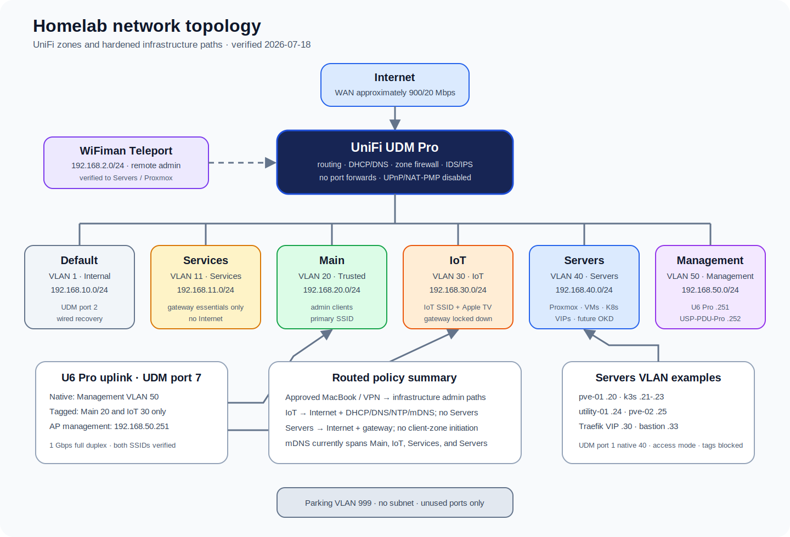

# Network Topology and UniFi Policy

This page records the live UniFi topology and the security boundaries around the homelab. Address assignments for individual hosts remain canonical in the [Infrastructure Reference](infrastructure-reference.md).

Last verified: 2026-07-18, after the physical-port, administrative-scope, and configuration-drift hardening pass.

## Topology

The UDM Pro is the router, DHCP/DNS authority, firewall, IDS/IPS enforcement point, and Teleport endpoint. VLANs terminate on the UDM Pro; zone rules control routed traffic between them.

The U6 Pro uplink is a small, explicit trunk: Management VLAN `50` is native for the AP itself, while Main VLAN `20` and IoT VLAN `30` are the only tagged networks. Proxmox and its VMs use native Servers VLAN `40`, so VM NIC VLAN tags remain blank.

## VLAN and Zone Matrix

| VLAN | UniFi network / zone | Subnet | Purpose | Internet | Important notes |
|---:|---|---|---|---|---|
| `1` | Default / Internal | `192.168.10.0/24` | Wired recovery and legacy/default access | Yes | UDM port 2 is retained as the tested recovery path; it assigned `192.168.10.242` during verification. |
| `11` | Services / Services | `192.168.11.0/24` | Isolated service discovery when needed | No | DHCP, DNS, NTP, and mDNS to the gateway are allowed before a gateway catch-all block. No permanent client is documented. |
| `20` | Main / Trusted | `192.168.20.0/24` | Primary user and administrative clients | Yes | The `WeDontHaveInternet` SSID uses WPA2/WPA3 transition mode with optional PMF. |
| `30` | IoT / IoT | `192.168.30.0/24` | Wireless and wired consumer devices | Yes | Gateway access is limited to DHCP, DNS, NTP, and mDNS; gateway HTTPS and Servers access are blocked. |
| `40` | Servers / Servers | `192.168.40.0/24` | Proxmox, VMs, Kubernetes, OKD, and service VIPs | Yes | Servers cannot initiate into Trusted, IoT, Services, Management, Internal, or VPN. Approved Trusted, Management, and VPN connections receive stateful return traffic. |
| `50` | Management / Management | `192.168.50.0/24` | UniFi infrastructure management | Yes | DHCP pool is `.100-.199`; the AP and PDU use controlled static addresses outside that pool. mDNS forwarding is off. |
| `999` | Parking | None assigned | Unused physical ports | No | Use as the native network for an intentionally parked port, or disable the port. |

WiFiman Teleport uses `192.168.2.0/24` and is the sole remote-access VPN. It has been tested over cellular from `192.168.2.4` to the Proxmox UI on `192.168.40.20:8006`. The unused standalone WireGuard network object and its `192.168.13.0/24` pool have been deleted.

## UDM Pro Port Map

| Port | Connected device / role | Native network | Tagged networks | Current state |
|---:|---|---|---|---|
| `1` | `pve-01` | Servers VLAN `40` | Blocked | Active at 1 Gbps in native/access mode. Add only explicitly required tagged VLANs if a future VM needs them; do not restore an unrestricted trunk. |
| `2` | Wired recovery | Default VLAN `1` | Currently not explicitly restricted | Keep available for recovery, but block all tagged VLANs. The recovery path has been tested at 1 Gbps. |
| `3` | Living Room Apple TV | IoT VLAN `30` | Blocked | Active native-only access port. |
| `4` | Unused | Review | Review | Disable it or move it to Parking VLAN `999`. |
| `5` | USP-PDU-Pro | Management VLAN `50` | Blocked | Active at 100 Mbps full duplex; the device is `192.168.50.252`. |
| `6` | Unused | Review | Review | Disable it or move it to Parking VLAN `999`. |
| `7` | U6 Pro | Management VLAN `50` | Main `20`, IoT `30` only | Active at 1 Gbps full duplex; the AP is `192.168.50.251`. |
| `8` | Stale `USP-PDU-Pro` label | Not the PDU uplink | — | Correct or remove the misleading label. |
| `9`, `11` | Unused | — | — | Disabled. |

Ports not listed here have no documented homelab-specific role. Confirm the live UniFi port view before changing them.

## Wireless and IoT Layout

The two production broadcasts are:

| SSID | VLAN | Security | Use |
|---|---:|---|---|
| `WeDontHaveInternet` | Main `20` | WPA2/WPA3 transition, optional PMF | Trusted user and admin clients |
| `WeDontHaveInternet-IoT` | IoT `30` | WPA2-compatible | Consumer and embedded devices |

Reserved IoT addresses verified during the migration are:

| Device | Address | Connection |
|---|---:|---|
| Airmega unit 1 | `192.168.30.32` | Wi-Fi |
| Airmega unit 2 | `192.168.30.16` | Wi-Fi |
| Denon receiver | `192.168.30.78` | IoT network |
| LG TV | `192.168.30.214` | IoT network |
| Living Room Apple TV | `192.168.30.74` | Wired, UDM port 3 |
| Nest thermostat | `192.168.30.141` | Wi-Fi |

Cross-VLAN AirPlay discovery and control from Main are working. mDNS currently forwards all service types across Main, IoT, Services, and Servers. The wired Apple TV has one source-MAC-scoped callback rule to Main for TCP/UDP `49152-65535`. Narrow mDNS to Main and IoT and to the required service types through the supported UniFi UI when practical.

## Security Boundaries

- IDS/IPS runs in prevention mode across Default, Services, Main, IoT, Servers, and Management, with all 36 configured categories enabled.
- UPnP and NAT-PMP are disabled. There are no configured port forwards or static routes.
- IoT can use gateway DHCP, DNS, NTP, and mDNS plus the Internet, but cannot open the gateway management UI or initiate into Servers.
- Services can use gateway DHCP, DNS, NTP, and mDNS, but has no Internet access and is blocked from other gateway services.
- Servers can reach the gateway and Internet but cannot initiate connections into client, management, service, internal, or VPN zones.
- Trusted-to-Management and Trusted-to-Servers administrative access is restricted to the approved MacBook's stable Main-network identity. Trusted-to-IoT remains broad enough for device control, discovery, and Garmin-to-phone workflows.
- The four broad Management-to-Trusted, Management-to-Servers, Management-to-Services, and Management-to-IoT initiation rules have been removed. Stateful response traffic and gateway access remain available to management devices.
- The obsolete `Teleport-ServerVLAN` rule has been removed. Teleport retains unrestricted VPN-to-Trusted and VPN-to-Servers paths, independent of the Trusted admin-device scope.
- Teleport gateway access remains at UniFi's system default. A narrower DNS/NTP allow plus management-plane block interrupted the tunnel and was rolled back.
- All routed LAN DHCP domains are standardized on `lab.home.arpa`. LAN IPv6 interfaces are explicitly disabled with router advertisements off; both WANs use manual IPv6 preference with delegation disabled.

## Operational Notes

- Preserve UDM port 2 as a wired recovery path during firewall, VLAN, AP, or switch-port changes.
- Export a current System Config Backup before network-policy changes and verify local-console access from the recovery port.
- When changing a native network, first confirm the device's static address, gateway, and DNS will be valid on the destination VLAN.
- Use allow-first ordering: install and verify required exceptions before enabling a zone or gateway catch-all block.
- Test both UDP and TCP DNS, Internet access, management access, and cross-VLAN discovery after relevant changes.
- Keep the DHCP pools unchanged unless a documented stable-address need arises. Use reservations or controlled static addresses outside the pool.
- UniFi device SSH password authentication should be disabled when not required, or replaced with key-only authentication.
- Treat `lab.home.arpa` as the DHCP search domain and `lab.seandre.dev` as the canonical private split-DNS zone; they serve different purposes.
- If IPv6 is introduced later, document and enable it deliberately across the required LAN and WAN paths rather than restoring partial legacy flags.

## Hardening Backlog

1. Block tagged VLANs on recovery port 2, and disable ports 4 and 6 or move them to Parking VLAN `999`.
2. If a future Proxmox guest needs another VLAN, allow only that explicit VLAN on port 1 after documenting the requirement.
3. Narrow mDNS network and service scope through the supported UI.
4. Disable UniFi device SSH when it is not required, or replace password authentication with key-only access.
5. Export a post-change backup, revoke the temporary API key, remove the local API-header file after controller work is complete, and perform a documented restore drill.

The broader physical-reliability backlog is a UPS, a second AP or WAN path if justified, and deliberate cabling and failover tests.
